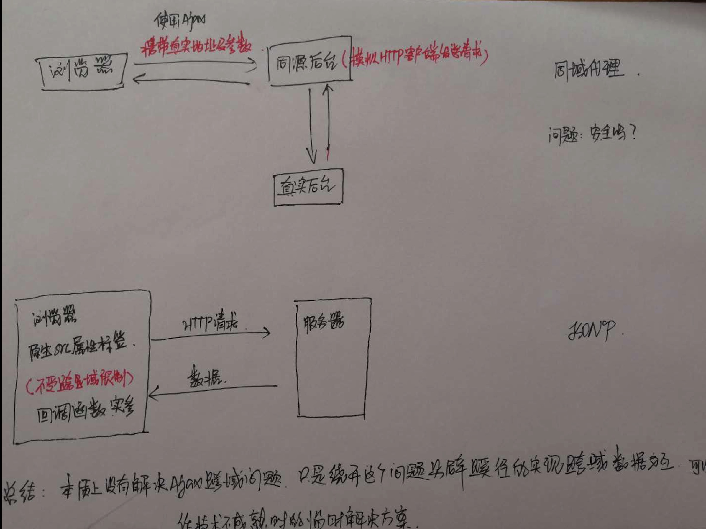

#### 跨域及CORS
**背景**： 处于安全考虑，提出同源策略，浏览器在发出Ajax请求时，只允许接受同域服务器响应的数据资源（及同协议、域名、端口）。  
**跨域** ：很明显的问题，即使是自己的服务器，而二级域名和三级域名不一致，也会出现跨域，如：http://img.xiling.me 与 http://blog.xiling.me 之间需要数据交互，就需要跨域。  
**临时解决方案**：jsonp和CORS  
同域代理就是使用Ajax向同域下的后台发送请求，同时携带真实请求的地址及参数，后台接受请求后直接根据地址及参数转发请求，因为后台是可以直接模拟HTTP客户端发送请求的，所以没有跨域问题，而后台接受到响应数据后再原样返回给前端浏览器，从而实现跨域数据交互；  

JSONP是利用了 script 标签的 src 属性来实现跨域数据交互的，因为浏览器解析HTML代码时，原生具有src属性的标签，浏览器都赋予其HTTP请求的能力，而且不受跨域限制，使用src发送HTTP请求，服务器直接返回一段JS代码的函数调用，将服务器数据放在函数实参中，前端提前写好响应的函数准备回调，接收数据，实现跨域数据交互；
JSONP 是目前应用最为广泛的技术解决方案，我们使用的 百度、淘宝、360搜索等各大搜索引擎的关键字推举都在使用JSONP技术；  

**正统解决方案**
跨域资源共享CORS：https://note.youdao.com/share/?id=f56ff8335c86122ec1e6eaa4208d033a&type=notebook#/1E6E77A2F8434CB5B09F1B1A90E5BCAB   
看看人家写的笔记，一个字：透彻！  
自己可以之后写篇博客总结一下CORS

#### jsonp案例
